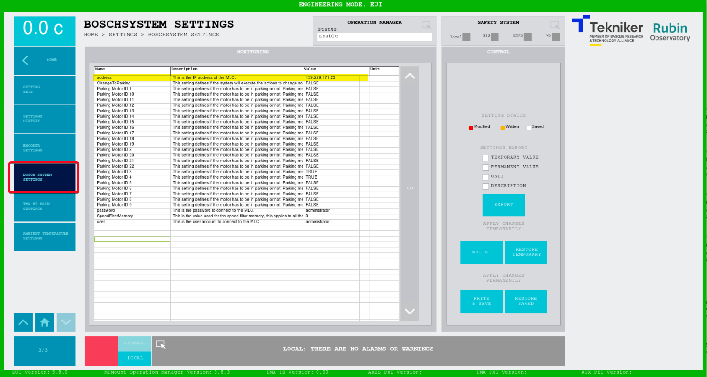
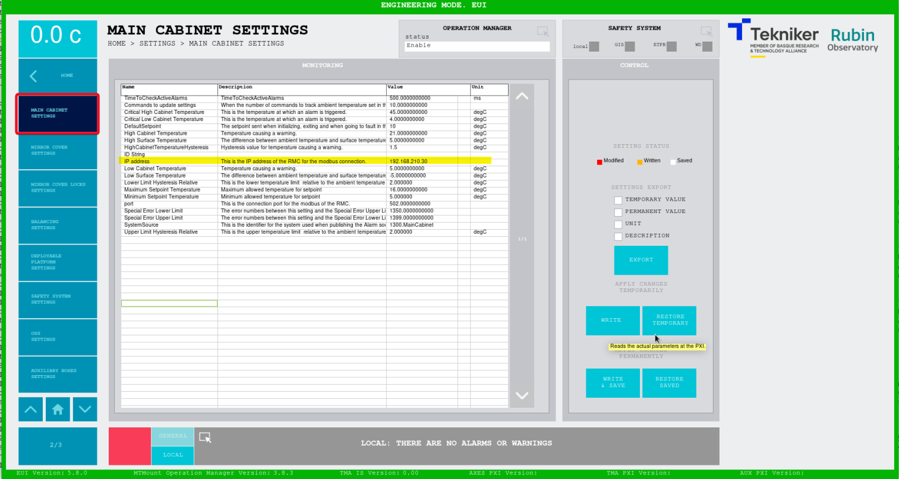
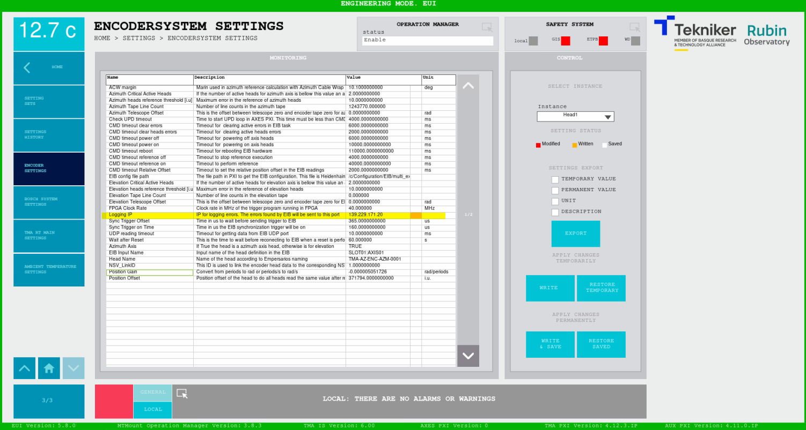
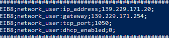
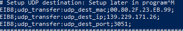

# Change IPs

## Introduction

This document gathers all the different locations where the IPs must be updated after changing the IP of the network
interfaces for each device.

In the next list some locations are described. These locations will be used along the document as reference only:

- EUI configuration file --> `/usr/local/TMA/data/HMIConfig.xml`
- PXI configuration file --> `/c/Configuration/TMA_PXI_RT_MainConfig.ini` This file has a different name in the
  AXES PXI `MainAxisConfig.ini`

### Settings Database

The settings database is located in the MCC, so the IP for the Database must match the IP of the MCC in all the devices
that need access to the settings, these are:

- EUI
- TMA PXI
- AUX PXI

#### EUI

In the EUI configuration file find the Database_Settings field and update the IP in the Host_IP field.

```xml
<Database_Settings mems='4'>
    <Host_IP type='String'>192.168.209.200</Host_IP>
    <Port type='U16'>3306</Port>
    <Options mems='3'>
        <Timeout type='U32'>500</Timeout>
        <Read_Timeout type='U32'>500</Read_Timeout>
        <Auto_Reconnect type='Bool'>FALSE</Auto_Reconnect>
    </Options>
    <clientAuthentication mems='3'>
        <username type='String'>root</username>
        <password type='String'>example</password>
        <database type='String'>lsst_settings</database>
    </clientAuthentication>
</Database_Settings>
```

#### TMA PXI and AUX PXI

Update IPs in the PXI configuration files for the AUX and TMA PXIs. After changing these IPs reboot the PXI to apply the
changes.

- Database update:

  ```ini
  [Settings Database]
  IP = "192.168.209.200"
  ```

### MtMount Operation Manager

As the MtMount Operation Manager must connect to both TMA and AUX PXIs, the configuration must be updated. To do so the
configuration file for the MtMount Operation Manager service must be updated, this file is the
`/etc/mtmount_operation_manager/config.json`, here update the `pxi.ip` sections for both PXIs.

```json
    "pxi": [
        {
            "id": 0,
            "ip": "192.168.209.10",
            "port": 50006,
            "commandNumberOfRetries": 2
        },
        {
            "id": 1,
            "ip": "192.168.209.11",
            "port": 50006,
            "commandNumberOfRetries": 2
        }
    ],

```

### EUI Telemetry

In the EUI configuration file in the TekNsvClientConfiguration# fields update the Remote_adress field for all clients.

```xml
<TekNsvClientConfiguration0>
    <Remote_Adress type="String">192.168.209.10</Remote_Adress>
    <Remote_Port type="U16">50116</Remote_Port>
    <Connect_Timeout_in_ms type="I32">100</Connect_Timeout_in_ms>
    <Send-Receive_Timeout_in_ms type="I32">100</Send-Receive_Timeout_in_ms>
    <ReadResponses type="Bool">FALSE</ReadResponses>
    <bytes_to_read type="I32">5000000</bytes_to_read>
    <ReadMode type='Enum U16' sel='CRLF'>2</ReadMode>
    <Check_Connection_time_ms type="I32">200</Check_Connection_time_ms>
    <ReadDataFromTCP type="Bool">TRUE</ReadDataFromTCP>
</TekNsvClientConfiguration0>
<TekNsvClientConfiguration1>
    <Remote_Adress type="String">192.168.209.11</Remote_Adress>
    <Remote_Port type="U16">50116</Remote_Port>
    <Connect_Timeout_in_ms type="I32">100</Connect_Timeout_in_ms>
    <Send-Receive_Timeout_in_ms type="I32">100</Send-Receive_Timeout_in_ms>
    <ReadResponses type="Bool">FALSE</ReadResponses>
    <bytes_to_read type="I32">1000000</bytes_to_read>
    <ReadMode type='Enum U16' sel='CRLF'>2</ReadMode>
    <Check_Connection_time_ms type="I32">200</Check_Connection_time_ms>
    <ReadDataFromTCP type="Bool">TRUE</ReadDataFromTCP>
</TekNsvClientConfiguration1>
```

In addition, the TelemetryTopicsConfiguration.ini must be updated accordingly, replacing the old IP of the variables
with the new PXI IPs. All data types must be updated, and the new IPs must match the IPs defined in the EUI configuration
file.

```ini
String Array Telemetry Data 0.url = "psp://192.168.209.10/PXIComm_NSV/Azimuth Interlocks"
```

### Bosch controller (MLC)

The bosch controller connection IP is a settings, so it can be modified using the EUI. In the EUI navigate to *SETTINGS*
and then to *BOSCH SYSTEM SETTINGS*. In this window update the address field to match the new IP set on the Bosch Controller.
A reboot of the TMA PXI is mandatory to apply the change.

This setting must safely stored, to do so the "WRITE & SAVE" button must be used, keep in mind that this button is only
visible for the maintenance level user, not all users can save settings.



> **NOTE**
>
> All settings sets must be updated with this new setting value, otherwise the IP will go back to its original value
> when a new set is applied

### Main Cabinet temperature controller

The communication IP for the main cabinet controller, AZ-CBT-0001, is also a setting, the same procedure as for the
[Bosch Controller](#bosch-controller-mlc) must be carried out.



> **NOTE**
>
> All settings sets must be updated with this new setting value, otherwise the IP will go back to its original value
> when a new set is applied

### Encoder system (EIB)

For the encoder there are 2 IPs that must be updated, one in the encoder settings and one in the EIB configuration file,
located in the TMA PXI `/c/Configuration/EIB/multi_ext.txt`.

- Encoder settings, here the IP of the TMA PXI must be set, is to define to which IP the events will be sent.
  
- Encoder config file, here the IP of the EIB is defined as well as the IP and MAC of the UDP packets destination.
  - EIB IP:
    
  - UDP destination:
    

### Modbus temperature controllers

Update the configuration files in the AuxPXI located at `/c/Configuration/ModbusTemperatureControllers` named
**XXX_config.ini** that have the following format:

```ini
[ModbusServerConfiguration]
IsMaster = TRUE
Address = "139.229.171.19"
Port = 502
Little Endian = FALSE
UpdateTime_ms = 500
Unit ID = 10
```

### Analog and Digital telemetry in AUX PXI

The telemetry from the analog and digital inputs of the TMA is obtained in the AUX PXI, this targets the inputs from the
TMA PXI. Therefore the `TelemetryConfig.ini` config file located at `/c/Configuration/TelemetryConfig` must be updated
accordingly.

### TekNSV Variables between PXIs

TMA and AUX PXIs interchange several TekNSV variables these are sent over a TCP connection, this connection has a
configuration file in each PXI `/c/Configuration/TekNSVs/VariablesToSubscribeClientConfig.xml`.

```xml
<?xml version="1.0" encoding="utf-8"?>
<GXML_Root>
  <SenderConnectionData>
    <Remote_Adress type="String">192.168.209.10</Remote_Adress>
    <Remote_Port type="U16">50116</Remote_Port>
    <Connect_Timeout_in_ms type="I32">100</Connect_Timeout_in_ms>
    <Send-Receive_Timeout_in_ms type="I32">100</Send-Receive_Timeout_in_ms>
    <ReadResponses type="Bool">FALSE</ReadResponses>
    <bytes_to_read type="I32">1000000</bytes_to_read>
    <ReadMode type='Enum U16' sel='CRLF'>2</ReadMode>
    <Check_Connection_time_ms type="I32">200</Check_Connection_time_ms>
    <ReadDataFromTCP type="Bool">TRUE</ReadDataFromTCP>
  </SenderConnectionData>
</GXML_Root>
```

### OSS

The TMA control system communicates with the OSS (Oil Supply System) by modbus TCP, therefore if the OSS IP is changed
the AUX PXI must be updated to point to the new IP. This can be done by modifying the `/c/Configuration/OSS/ServerConfig.ini`
to update the `Address` field. Once the file is modified the AUX PXI must be rebooted to update the change.

```ini
[ModbusServerConfiguration]
IsMaster = TRUE
Address = "192.168.209.130"
Port = 50052
Little Endian = FALSE
UpdateTime_ms = 100
```

### Additional IPs

For communications between the PXIs and the targets there are places where the IPs were originally hardcoded, these IPs
are now configurable with a specific section in the EUI configuration file. This section has the following options:

- ***tmaPxiIp*** here the IP for the TMA PXI is defined. Default value: 192.168.209.10.
- ***auxPxiIp*** here the IP for the AUX PXI is defined. Default value: 192.168.209.11.
- ***axesPxiIp*** here the IP for the AXES PXI is defined. Default value: 192.168.213.11.
- ***tmaIsIp*** here the IP for the TMA IS (Safety CPU) is defined. Default value: 192.168.180.10.
- ***mcc*** here the IP for the MCC (server running the EUI) is defined. Default value: 192.168.209.200.

```ini
[IPs]
tmaPxiIp = 139.229.171.3
auxPxiIp = 139.229.171.4
axesPxiIp = 139.229.171.26
tmaIsIp = 192.168.180.10
mcc = 139.229.171.6
```

### Chronyd

While using the chronyd service for time sync, the configuration file for the service must be updated to match the IP
changes. There is a different file in each device, MCC, TMA PXI, AUX PXI and AXES PXI, located at `/etc/chrony.conf`.
