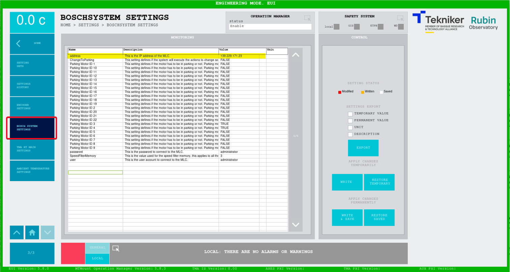

# Change IPs

## Introduction

This document explains who to change the IPs of MCS elements.

In next list some locations are described. These locations will be used along the document as reference only

* EUI configuration file --> "/usr/local/TMA/data/HMIConfig.xml"
* PXI configuration file --> "/c/Configuration/TMA_PXI_RT_MainConfig.ini"

### Database

The database is located in the MCC computer, so the IP must match the IP of the MCC computer. The IP value must be update in several places

#### EUI

In the EUI configuration file fin the Database_Settings field and change the IP in the Host_IP field

```xml
<Database_Settings mems='4'>
    <Host_IP type='String'>192.168.209.200</Host_IP>
    <Port type='U16'>3306</Port>
    <Options mems='3'>
        <Timeout type='U32'>500</Timeout>
        <Read_Timeout type='U32'>500</Read_Timeout>
        <Auto_Reconnect type='Bool'>FALSE</Auto_Reconnect>
    </Options>
    <clientAuthentication mems='3'>
        <username type='String'>root</username>
        <password type='String'>example</password>
        <database type='String'>lsst_settings</database>
    </clientAuthentication>
</Database_Settings>
```

#### TMAPXI and AuxPXI

Change the IP for the database in the PXI configuration file. After changing this IP a reboot of the PXI is mandatory to apply the new IP.

```bash
[Settings Database]
IP = "192.168.209.200"
```

### Operation manager configuration

The configuration of the PXIs to connect to from the operation manager must be changed. Change the PXI "ip" field for both pxis. The PXI with "id" 0 is the TMAPXI, while the "id" 1 is the AuxPXI.

```json
    "pxi": [
        {
            "id": 0,
            "ip": "192.168.209.10",
            "port": 50006,
            "commandNumberOfRetries": 2
        },
        {
            "id": 1,
            "ip": "192.168.209.11",
            "port": 50006,
            "commandNumberOfRetries": 2
        }
    ],

```

### Telemetry configuration

#### MCC

In the EUI configuration file in the TekNsvClientConfiguration fields for all clients, change the Remote_adress field.

```xml
<TekNsvClientConfiguration0>
    <Remote_Adress type="String">192.168.209.10</Remote_Adress>
    <Remote_Port type="U16">50116</Remote_Port>
    <Connect_Timeout_in_ms type="I32">100</Connect_Timeout_in_ms>
    <Send-Receive_Timeout_in_ms type="I32">100</Send-Receive_Timeout_in_ms>
    <ReadResponses type="Bool">FALSE</ReadResponses>
    <bytes_to_read type="I32">5000000</bytes_to_read>
    <ReadMode type='Enum U16' sel='CRLF'>2</ReadMode>
    <Check_Connection_time_ms type="I32">200</Check_Connection_time_ms>
    <ReadDataFromTCP type="Bool">TRUE</ReadDataFromTCP>
</TekNsvClientConfiguration0>
<TekNsvClientConfiguration1>
    <Remote_Adress type="String">192.168.209.11</Remote_Adress>
    <Remote_Port type="U16">50116</Remote_Port>
    <Connect_Timeout_in_ms type="I32">100</Connect_Timeout_in_ms>
    <Send-Receive_Timeout_in_ms type="I32">100</Send-Receive_Timeout_in_ms>
    <ReadResponses type="Bool">FALSE</ReadResponses>
    <bytes_to_read type="I32">1000000</bytes_to_read>
    <ReadMode type='Enum U16' sel='CRLF'>2</ReadMode>
    <Check_Connection_time_ms type="I32">200</Check_Connection_time_ms>
    <ReadDataFromTCP type="Bool">TRUE</ReadDataFromTCP>
</TekNsvClientConfiguration1>
```

Also in the TelemetryTopicsConfiguration.ini change the IP in the url data to the new PXI IPs

```ini
String Array Telemetry Data 0.url = "psp://192.168.209.10/PXIComm_NSV/Azimuth Interlocks"
```

### Elements configuration

#### Bosch controller

The bosch controller connection IP is a settings, so it can be modified using the EUI. In the EUI navigate to SETTINGS and then to BOSCH SYSTEM SETTINGS. In this window change the address field. A reboot of the TMAPXI is mandatory to update the IP in the control.

This setting must "WRITE & SAVE". To "WRITE & SAVE" the user must be a maintenance user.



> **NOTE**
>
> All settings sets must be updated with this new setting value

#### Main Cabinet temperature controller


